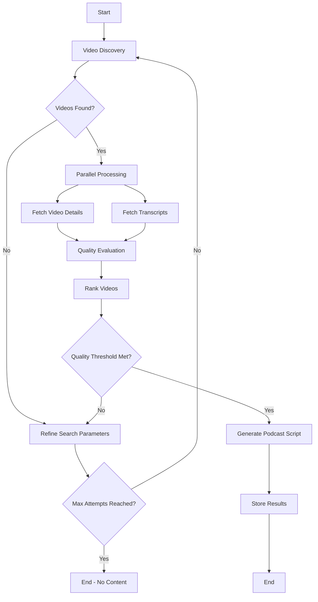

# Design Document

## Overview

The nanook-curator is an AI-powered content curation system built using LangGraph that automatically discovers trending YouTube videos about AI news, tools, and agents, analyzes their content through transcripts, and generates curated podcast scripts of 5-10 minutes in length. The system leverages LangGraph's state management and parallel processing capabilities to efficiently handle video discovery, transcript fetching, quality evaluation, and script generation with automated scheduling capabilities.

This LangGraph implementation demonstrates both parallel processing and conditional routing patterns while maintaining beginner-friendly clarity. The parallel processing of video details and transcripts reduces processing time by ~50% while LangGraph's state management ensures data consistency. The iterative refinement loops ensure robust content discovery by automatically refining search parameters when results don't meet quality thresholds. The weekly focus supports consistent podcast production, and the state-driven approach with conditional edges makes the system both predictable and adaptive to content availability.

**Key Design Principles:**
- **Automated Scheduling**: Designed to run automatically on configurable schedules for continuous content generation
- **Quality-First Curation**: Prioritizes high-quality content through multi-metric evaluation and quality thresholds
- **Weekly Focus**: Optimized for weekly podcast production with 7-day content freshness requirements
- **Parallel Processing**: Video fetching and transcript analysis run concurrently for efficiency
- **Robust Error Handling**: Graceful degradation ensures continuous operation despite individual video failures
- **Modularity**: Each processing step is a separate LangGraph node for clarity and maintainability

## Architecture

### LangGraph State Schema

The system uses a centralized state object that flows through all nodes:

```python
from typing import List, Dict, Optional
from pydantic import BaseModel

class VideoData(BaseModel):
    video_id: str
    title: str
    channel: str
    view_count: int
    like_count: int
    comment_count: int
    upload_date: str
    transcript: Optional[str] = None
    quality_score: Optional[float] = None
    key_topics: List[str] = []

class CuratorState(BaseModel):
    # Input parameters
    search_keywords: List[str]
    max_videos: int = 10
    days_back: int = 7  # Focus on past week for weekly podcast
    
    # Processing state
    discovered_videos: List[VideoData] = []
    processed_videos: List[VideoData] = []
    ranked_videos: List[VideoData] = []
    
    # Iterative refinement state
    search_attempt: int = 0
    max_search_attempts: int = 3
    current_search_terms: List[str] = []
    quality_threshold: float = 70.0
    min_quality_videos: int = 3
    
    # Output
    podcast_script: Optional[str] = None
    generation_metadata: Dict = {}
    
    # Error handling
    errors: List[str] = []
```

### Graph Flow Architecture




## Components and Interfaces

### 1. Video Discovery Node

**Purpose**: Searches YouTube for trending AI-related videos with iterative refinement

```python
def discover_videos_node(state: CuratorState) -> CuratorState:
    """
    Discovers trending YouTube videos based on search keywords
    Focuses on videos from the past week for weekly podcast production
    Implements iterative search refinement if insufficient results
    """
    # Implementation details in tasks
```

**Inputs**: `search_keywords`, `max_videos`, `days_back`, `search_attempt`
**Outputs**: `discovered_videos` (list of VideoData with basic metadata), updated `search_attempt`
**Search Strategy**:
- **Primary search**: Use original keywords with 7-day filter
- **Refinement attempt 1**: Expand keywords with synonyms and related terms
- **Refinement attempt 2**: Relax date filter to 14 days while maintaining quality focus
- **Refinement attempt 3**: Use broader AI-related terms with engagement-based filtering
**External Dependencies**: YouTube Data API v3

### 2. Video Details Fetcher Node

**Purpose**: Fetches detailed metadata for discovered videos (runs in parallel with transcript fetching)

```python
def fetch_video_details_node(state: CuratorState) -> CuratorState:
    """
    Fetches detailed video metadata including engagement metrics
    """
    # Implementation details in tasks
```

**Inputs**: `discovered_videos`
**Outputs**: Updates `discovered_videos` with detailed metrics
**External Dependencies**: YouTube Data API v3

### 3. Transcript Fetcher Node

**Purpose**: Retrieves video transcripts (runs in parallel with details fetching)

```python
def fetch_transcripts_node(state: CuratorState) -> CuratorState:
    """
    Fetches transcripts for all discovered videos
    """
    # Implementation details in tasks
```

**Inputs**: `discovered_videos`
**Outputs**: Updates `discovered_videos` with transcript data
**External Dependencies**: youtube-transcript-api library

### 4. Quality Evaluation Node

**Purpose**: Analyzes and scores video quality based on multiple criteria

```python
def evaluate_quality_node(state: CuratorState) -> CuratorState:
    """
    Evaluates video quality using engagement metrics and content analysis
    """
    # Implementation details in tasks
```

**Inputs**: `discovered_videos` (with details and transcripts)
**Outputs**: `processed_videos` with quality scores
**Quality Metrics**:
- **Engagement score**: Like-to-dislike ratio (minimum 80% threshold), comment sentiment analysis, view-to-subscriber ratio
- **Content quality**: Transcript coherence, technical accuracy indicators, information density
- **Freshness score**: Upload date weighting (7-day preference), trending indicators, view count growth
- **Minimum thresholds**: Videos below 1000 views or older than 7 days are excluded during discovery

### 5. Video Ranking Node

**Purpose**: Ranks videos by combined quality scores with feedback loop

```python
def rank_videos_node(state: CuratorState) -> CuratorState:
    """
    Ranks videos by quality score and evaluates if results meet threshold
    Triggers discovery refinement if insufficient quality videos found
    """
    # Implementation details in tasks
```

**Inputs**: `processed_videos`, `quality_threshold`, `min_quality_videos`
**Outputs**: `ranked_videos` (top 3-5 videos), quality assessment flag
**Quality Assessment**:
- **Sufficient quality**: At least 3 videos above quality threshold (70+)
- **Insufficient quality**: Triggers return to search refinement node, then back to discovery
- **Weekly focus bonus**: Videos from past 7 days receive quality score boost

### 6. Podcast Script Generation Node

**Purpose**: Creates cohesive podcast script from top-ranked videos

```python
def generate_script_node(state: CuratorState) -> CuratorState:
    """
    Generates podcast script from top-ranked videos
    """
    # Implementation details in tasks
```

**Inputs**: `ranked_videos`
**Outputs**: `podcast_script`, `generation_metadata`
**Script Requirements**:
- **Length**: Target 5-10 minutes of speaking time (750-1500 words)
- **Structure**: Introduction, main content synthesis, conclusion with smooth transitions
- **Source attribution**: Include references to original video sources
- **Content flow**: Coherent narrative combining insights from top 3-5 videos
- **Auto-trimming**: Automatically reduce content if exceeding 10-minute target while maintaining coherence
**External Dependencies**: OpenAI GPT API for script generation

### 7. Search Refinement Node

**Purpose**: Refines search parameters when insufficient videos are found OR when quality threshold is not met

```python
def refine_search_node(state: CuratorState) -> CuratorState:
    """
    Refines search parameters based on previous attempt results
    Handles both initial discovery failures and quality threshold failures
    Implements progressive search strategy for better content discovery
    """
    # Implementation details in tasks
```

**Inputs**: `search_attempt`, `current_search_terms`, `discovered_videos`, `ranked_videos`
**Outputs**: Updated `current_search_terms`, incremented `search_attempt`
**Refinement Strategy**:
- **Attempt 1**: Add synonyms ("AI tools" → "artificial intelligence tools", "machine learning")
- **Attempt 2**: Include trending hashtags and expand to related channels
- **Attempt 3**: Broaden to general tech content with AI mentions
- **Weekly Focus**: Always prioritize past 7 days, only expand timeframe as last resort
- **Quality-based refinement**: Analyzes why videos failed quality threshold and adjusts search accordingly

### 8. Storage Node

**Purpose**: Persists results and metadata

```python
def store_results_node(state: CuratorState) -> CuratorState:
    """
    Stores generated script and metadata including search refinement history
    """
    # Implementation details in tasks
```

**Inputs**: Complete state with podcast script
**Outputs**: Persisted data, updated metadata including search attempts and refinements

## Data Models

### Key Data Models

**VideoData Model** (defined in state schema above):
- Core metadata: video_id, title, channel, engagement metrics
- Content: transcript text and extracted key topics  
- Quality: calculated quality score (0-100) and ranking position

**Script Metadata Model**:
- **generation_timestamp**: When script was created
- **source_videos**: List of video IDs used with their quality scores
- **search_refinement_history**: Record of search attempts and refinements
- **total_processing_time**: Time taken for complete process
- **word_count**: Final script word count
- **estimated_duration**: Estimated speaking time (750-1500 words = 5-10 minutes)

## Error Handling

### Graceful Degradation Strategy
1. **Missing Transcripts**: Skip videos without transcripts, continue with available content
2. **API Rate Limits**: Implement exponential backoff and retry logic
3. **Insufficient Discovery Results**: Automatically refine search parameters up to 3 attempts before failing
4. **Quality Threshold Not Met**: Return to discovery with expanded search terms rather than lowering quality standards
5. **Weekly Content Shortage**: Only expand beyond 7-day window as final fallback while maintaining quality focus
6. **Script Generation Failure**: Retry with different video combinations from ranked list

### Error Logging
- All errors logged to `state.errors` list
- Detailed error context including node name, timestamp, and error details
- Non-blocking errors allow process continuation
- Critical errors halt execution with clear error messages

### LangGraph Error Handling
```python
def handle_node_error(func):
    """Decorator for graceful error handling in LangGraph nodes"""
    def wrapper(state: CuratorState) -> CuratorState:
        try:
            return func(state)
        except Exception as e:
            state.errors.append(f"{func.__name__}: {str(e)}")
            return state
    return wrapper
```

## Testing Strategy

### Testing Strategy

**Unit Testing**:
- Each LangGraph node tested independently with mock state objects
- Pydantic models ensure data integrity and validation
- Mock YouTube API responses for consistent, repeatable testing
- Quality evaluation algorithms tested with known video data sets

**Integration Testing**:
- Complete LangGraph flow testing with sample data
- Parallel processing verification and state merging validation
- Iterative refinement loop testing with various failure scenarios
- Error handling and recovery mechanism validation

**End-to-End Testing**:
- Live YouTube API testing (rate-limited) with real content
- Generated podcast script quality assessment
- Weekly scheduling and automated execution testing

**Test Data**: Predefined VideoData objects, real transcript samples, and saved API response fixtures enable offline testing while maintaining realistic data patterns.

## Packaging and Deployment

### Python Dependency Management
- Use `uv` for fast, reliable Python dependency management and virtual environment creation
- Configure `pyproject.toml` with `uv` compatibility for modern Python packaging standards
- Leverage `uv`'s speed advantages for development and deployment environments

### Deployment Strategy
- Dockerize the application for easy deployment with `uv` integration
- Include a simple CLI interface for running the workflow
- Use a configuration file for easy customization and future updates
- Ensure the workflow is scalable and can handle multiple concurrent requests

## LangGraph Implementation Details

### Graph Construction
```python
from langgraph.graph import StateGraph

def create_curator_graph():
    """Creates the LangGraph workflow with iterative refinement"""
    workflow = StateGraph(CuratorState)
    
    # Add nodes
    workflow.add_node("discover", discover_videos_node)
    workflow.add_node("refine_search", refine_search_node)
    workflow.add_node("fetch_details", fetch_video_details_node)
    workflow.add_node("fetch_transcripts", fetch_transcripts_node)
    workflow.add_node("evaluate", evaluate_quality_node)
    workflow.add_node("rank", rank_videos_node)
    workflow.add_node("generate_script", generate_script_node)
    workflow.add_node("store", store_results_node)
    
    # Define edges with conditional routing
    workflow.set_entry_point("discover")
    
    # Conditional routing after discovery
    workflow.add_conditional_edges(
        "discover",
        lambda state: "refine" if not state.discovered_videos and state.search_attempt < state.max_search_attempts else "process",
        {"refine": "refine_search", "process": "fetch_details"}
    )
    
    # Refinement loop
    workflow.add_edge("refine_search", "discover")
    
    # Parallel processing
    workflow.add_edge("discover", "fetch_details")
    workflow.add_edge("discover", "fetch_transcripts")
    workflow.add_edge(["fetch_details", "fetch_transcripts"], "evaluate")
    
    # Quality-based conditional routing
    workflow.add_conditional_edges(
        "rank",
        lambda state: "refine" if len([v for v in state.ranked_videos if v.quality_score >= state.quality_threshold]) < state.min_quality_videos and state.search_attempt < state.max_search_attempts else "generate",
        {"refine": "refine_search", "generate": "generate_script"}
    )
    
    workflow.add_edge("evaluate", "rank")
    workflow.add_edge("generate_script", "store")
    
    return workflow.compile()
```
