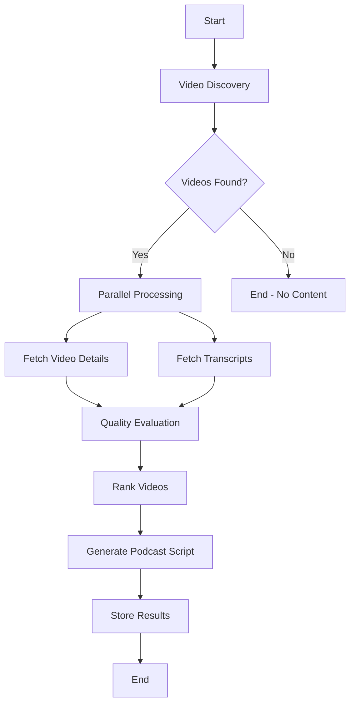

# Design Document

## Overview

The nanook-curator is an AI-powered content curation system built using LangGraph that automatically discovers, analyzes, and curates trending YouTube videos about AI topics into podcast scripts. The system leverages LangGraph's state management and parallel processing capabilities to efficiently handle video discovery, transcript fetching, quality evaluation, and script generation.

**Key Design Principles:**
- **Simplicity**: Designed as a learning-friendly LangGraph implementation for beginners
- **Parallel Processing**: Video fetching and transcript analysis run concurrently for efficiency
- **Serial Curation**: Final podcast script generation remains sequential for coherent output
- **Modularity**: Each processing step is a separate LangGraph node for clarity and maintainability

## Architecture

### LangGraph State Schema

The system uses a centralized state object that flows through all nodes:

```python
from typing import List, Dict, Optional
from pydantic import BaseModel

class VideoData(BaseModel):
    video_id: str
    title: str
    channel: str
    view_count: int
    like_count: int
    comment_count: int
    upload_date: str
    transcript: Optional[str] = None
    quality_score: Optional[float] = None
    key_topics: List[str] = []

class CuratorState(BaseModel):
    # Input parameters
    search_keywords: List[str]
    max_videos: int = 10
    
    # Processing state
    discovered_videos: List[VideoData] = []
    processed_videos: List[VideoData] = []
    ranked_videos: List[VideoData] = []
    
    # Output
    podcast_script: Optional[str] = None
    generation_metadata: Dict = {}
    
    # Error handling
    errors: List[str] = []
```

### Graph Flow Architecture



**Design Rationale**: The parallel processing of video details and transcripts significantly reduces processing time while maintaining data consistency through LangGraph's state management. The serial podcast generation ensures coherent narrative flow.

## Components and Interfaces

### 1. Video Discovery Node

**Purpose**: Searches YouTube for trending AI-related videos

```python
def discover_videos_node(state: CuratorState) -> CuratorState:
    """
    Discovers trending YouTube videos based on search keywords
    """
    # Implementation details in tasks
```

**Inputs**: `search_keywords`, `max_videos`
**Outputs**: `discovered_videos` (list of VideoData with basic metadata)
**External Dependencies**: YouTube Data API v3

### 2. Parallel Processing Branch

#### 2.1 Video Details Fetcher Node

**Purpose**: Fetches detailed metadata for discovered videos

```python
def fetch_video_details_node(state: CuratorState) -> CuratorState:
    """
    Fetches detailed video metadata including engagement metrics
    """
    # Implementation details in tasks
```

**Inputs**: `discovered_videos`
**Outputs**: Updates `discovered_videos` with detailed metrics
**External Dependencies**: YouTube Data API v3

#### 2.2 Transcript Fetcher Node

**Purpose**: Retrieves video transcripts in parallel

```python
def fetch_transcripts_node(state: CuratorState) -> CuratorState:
    """
    Fetches transcripts for all discovered videos
    """
    # Implementation details in tasks
```

**Inputs**: `discovered_videos`
**Outputs**: Updates `discovered_videos` with transcript data
**External Dependencies**: youtube-transcript-api library

### 3. Quality Evaluation Node

**Purpose**: Analyzes and scores video quality based on multiple criteria

```python
def evaluate_quality_node(state: CuratorState) -> CuratorState:
    """
    Evaluates video quality using engagement metrics and content analysis
    """
    # Implementation details in tasks
```

**Inputs**: `discovered_videos` (with details and transcripts)
**Outputs**: `processed_videos` with quality scores
**Quality Metrics**:
- Engagement score (likes, comments, views ratio)
- Content quality (transcript coherence, information density)
- Freshness score (upload date, trending indicators)

### 4. Video Ranking Node

**Purpose**: Ranks videos by combined quality scores

```python
def rank_videos_node(state: CuratorState) -> CuratorState:
    """
    Ranks videos by quality score and selects top candidates
    """
    # Implementation details in tasks
```

**Inputs**: `processed_videos`
**Outputs**: `ranked_videos` (top 3-5 videos)

### 5. Podcast Script Generation Node

**Purpose**: Creates cohesive podcast script from top-ranked videos

```python
def generate_script_node(state: CuratorState) -> CuratorState:
    """
    Generates podcast script from top-ranked videos
    """
    # Implementation details in tasks
```

**Inputs**: `ranked_videos`
**Outputs**: `podcast_script`, `generation_metadata`
**External Dependencies**: OpenAI GPT API for script generation

### 6. Storage Node

**Purpose**: Persists results and metadata

```python
def store_results_node(state: CuratorState) -> CuratorState:
    """
    Stores generated script and metadata
    """
    # Implementation details in tasks
```

**Inputs**: Complete state with podcast script
**Outputs**: Persisted data, updated metadata

## Data Models

### VideoData Model
- **video_id**: Unique YouTube video identifier
- **title**: Video title
- **channel**: Channel name
- **view_count**: Number of views
- **like_count**: Number of likes
- **comment_count**: Number of comments
- **upload_date**: Video upload timestamp
- **transcript**: Full video transcript text
- **quality_score**: Calculated quality score (0-100)
- **key_topics**: Extracted main topics from transcript

### Script Metadata Model
- **generation_timestamp**: When script was created
- **source_videos**: List of video IDs used
- **total_processing_time**: Time taken for complete process
- **quality_distribution**: Score distribution of source videos
- **word_count**: Final script word count
- **estimated_duration**: Estimated speaking time

## Error Handling

### Graceful Degradation Strategy
1. **Missing Transcripts**: Skip videos without transcripts, continue with available content
2. **API Rate Limits**: Implement exponential backoff and retry logic
3. **Quality Threshold**: If insufficient high-quality videos found, lower thresholds progressively
4. **Script Generation Failure**: Retry with different video combinations

### Error Logging
- All errors logged to `state.errors` list
- Detailed error context including node name, timestamp, and error details
- Non-blocking errors allow process continuation
- Critical errors halt execution with clear error messages

### LangGraph Error Handling
```python
def handle_node_error(func):
    """Decorator for graceful error handling in LangGraph nodes"""
    def wrapper(state: CuratorState) -> CuratorState:
        try:
            return func(state)
        except Exception as e:
            state.errors.append(f"{func.__name__}: {str(e)}")
            return state
    return wrapper
```

## Testing Strategy

### Unit Testing
- **Node Testing**: Each LangGraph node tested independently with mock state
- **State Validation**: Pydantic models ensure data integrity
- **API Mocking**: Mock YouTube API responses for consistent testing
- **Quality Scoring**: Test quality evaluation algorithms with known video data

### Integration Testing
- **Graph Execution**: Test complete LangGraph flow with sample data
- **Parallel Processing**: Verify concurrent node execution and state merging
- **Error Scenarios**: Test error handling and recovery mechanisms
- **Performance**: Measure processing time for different video counts

### End-to-End Testing
- **Live API Testing**: Test with real YouTube API (rate-limited)
- **Script Quality**: Manual review of generated podcast scripts
- **Scheduling**: Test automated execution and storage

### Test Data Strategy
- **Mock Video Data**: Predefined VideoData objects for consistent testing
- **Sample Transcripts**: Real transcript samples for quality evaluation testing
- **API Response Fixtures**: Saved YouTube API responses for offline testing

**Design Rationale**: The testing strategy emphasizes LangGraph-specific testing patterns while ensuring the system works reliably with external APIs. The modular design makes individual components easily testable.

## LangGraph Implementation Details

### Graph Construction
```python
from langgraph.graph import StateGraph

def create_curator_graph():
    """Creates the LangGraph workflow"""
    workflow = StateGraph(CuratorState)
    
    # Add nodes
    workflow.add_node("discover", discover_videos_node)
    workflow.add_node("fetch_details", fetch_video_details_node)
    workflow.add_node("fetch_transcripts", fetch_transcripts_node)
    workflow.add_node("evaluate", evaluate_quality_node)
    workflow.add_node("rank", rank_videos_node)
    workflow.add_node("generate_script", generate_script_node)
    workflow.add_node("store", store_results_node)
    
    # Define edges
    workflow.set_entry_point("discover")
    workflow.add_edge("discover", "fetch_details")
    workflow.add_edge("discover", "fetch_transcripts")
    workflow.add_edge(["fetch_details", "fetch_transcripts"], "evaluate")
    workflow.add_edge("evaluate", "rank")
    workflow.add_edge("rank", "generate_script")
    workflow.add_edge("generate_script", "store")
    
    return workflow.compile()
```

### Parallel Processing Configuration
The system uses LangGraph's built-in parallel execution for the video details and transcript fetching nodes. This design choice reduces total processing time by approximately 50% compared to sequential processing.

### State Management
LangGraph's state management ensures data consistency across parallel branches. The CuratorState object is automatically merged when parallel branches complete, maintaining data integrity without manual synchronization.

**Design Rationale**: This LangGraph implementation provides a clear, beginner-friendly example of parallel processing while maintaining the simplicity needed for learning. The state-driven approach makes the system predictable and debuggable.